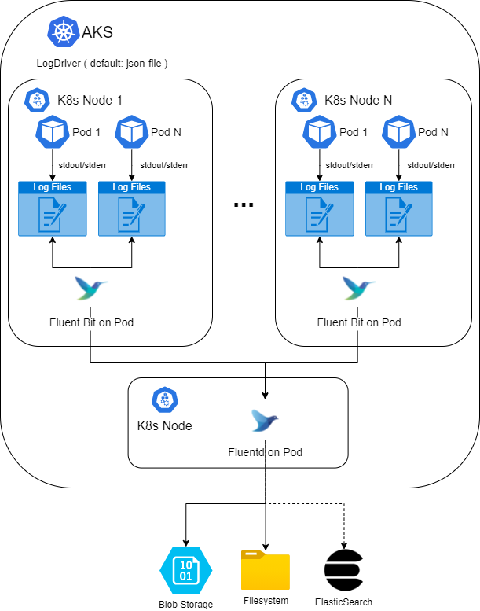

# Logging

Welcome to the logging project. On this folder you will find everything you need to set up the logging system.

## Introduction

The aim of the project is to make accessible the logs produced on the kubernetes cluster by the different containers on each pod.

We focus primarily on file base solutions as data store, that is solutions that can be closer to the idea of a centralized file system.

We consider two possible scenarios:

* On-premises
* Azure cloud

For on-premises we choose a centralised file system data storage. This means having all logs from the different containers on each pod, across all kubernetes nodes, on a central file system.

For Azure cloud we choose blob storage as the best option.

This doesn't mean we can not use another data storage, like Elasticsearch for instance, but we prefer for cost, maintenance and security file base solutions.

## Data collector

In order to send the logs from source to destiny we need a tool that collect the data and unify the logging layer. 

We choose [Fluentd](https://www.fluentd.org/) and [Fluent Bit](https://fluentbit.io/) to do the work.

As we can read on [this article](https://logz.io/blog/fluentd-vs-fluent-bit/) , the main differences between both tools are :

After many research we found that only Fluent Bit can support high load traffic, specially due the fact that on some kubernetes installation, like AKS on Azure, the log limit is 10Mb, this means that after 10Mb there is a log rotation. With Fluentd we see how it couldn't detect properly the log rotation, meaning that some logs get lost. Instead Fluent Bit has no problem with it.

On the other hand, we found [Fluentd](https://www.fluentd.org/) more configurable to store logs at destiny. This flexibility on the output allow us to create more convenient file structure.

For this reason we finally choose a centralized solution, where we set up on each kubernetes node a Fluent Bit that send the data to a Fluentd that collect all logs and, finally, store it on the central file base.

## Project structure 

In this project you will find the following folders:

### [Common](common/README.md)

Here we have the common files for both scenarios.

You will find a monitoring and a cronjob utility.

### Elasticsearch

Here you have the helm files to setup an Elastic stack with Curator, Kibana and Elasticsearch database.

Currently we split the installation depending on the environment:

* [azurecloud](elasticsearch/azurecloud/README.md)
* [on-premises](elasticsearch/on-premises/README.md)

### [Filebase](filebase/README.md)

This is the core of the project, we have a unique solution that fit alls environments.

* [README](filebase/README.md)

