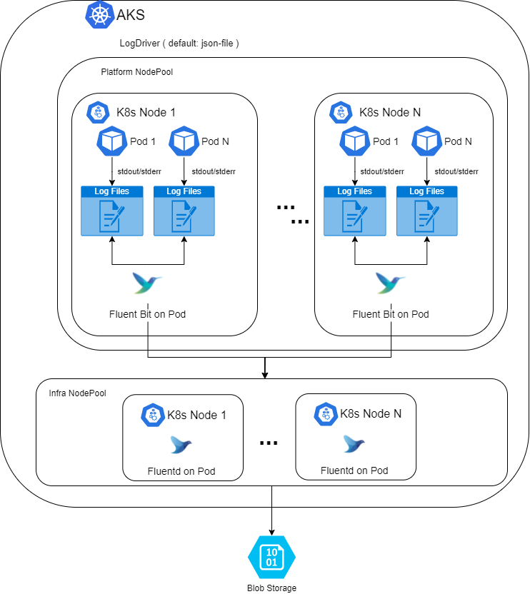

# File base

This is the core of the project.

## Project structure 

In this project you will find the following folders:

### config

This folder have the configuration for fluentd and fluentbit.

### perf-test

A simple performance test to generate a volume of logs that could be similar to the one we will find on production.

### script

Here you will find the compress script for azure blob storage logs.

### root

All the helm files needed for the project.


## Scenarios

We offer a solution that can fit on different scenarios.

To configure the scenarios we have the following variables, that we can setup on the environment files that you will find on the root directory of the project:

* logging:
  * enabled: [ true | false ]
  * fluentd
    * node: NODE_NAME
    * kind: [DaemonSet|Deploymnet]
    * dedicate_node_pool:  [ true | false ]
    * buffer_path: PATH_TO_STORE_BUFFER
    * 
  * output_to_filesystem: 
    * enabled: [ true | false ]
    * filesystem_path: PATH_TO_STORE_LOGS
    * retention_policy_days: RETENTION_DAYS
  * output_to_azurestorage: 
    * enabled: [ true | false ]
    * azure_container: kubernetes
    * azure_container_path: logs
    * add_newline: [ true | false ]

  * output_to_es: [ true | false ]

## Scenarios tested
### On premises

Here we have a centralized scenario where we have one fluentbit on each node an one fluentd on one node that will store all the files under a root path defined on *filesystem_path* variable.


The usual configuration that we will have on the config file will be:

```bash

fluentd
    node: NODE_NAME
    kind: Deployment
    dedicate_node_pool: false
    buffer_path: /mnt/pv/fluent_buffer

output_to_filesystem: 
    enabled: true
    filesystem_path: /mnt/pv/efk/fluentd
    retention_policy_days: 14

output_to_azurestorage: 
    enabled: false

output_to_es: 
    enabled: false
```

In this scenario we have a pod that takes care of the retention policy. What we do is create a *cronjob* that every day delete files older than *retention_policy_days*.
### Azure Cloud

In this case we will have one fluentbit on each node and many fluentd on a dedicate AKS nodepool that will write the logs to azure storage.



 The usual configuration that we will have on the config file will be:

```bash

fluentd
    kind: DaemonSet
    dedicate_node_pool: true 
    buffer_path: /mnt/fluent_buffer

output_to_filesystem: 
    enabled: false

output_to_azurestorage: 
    enabled: true
    azure_container: kubernetes
    azure_container_path: logs
    add_newline: true

output_to_es: 
    enabled: false
```

On this scenario we have a pod that takes care of the file compression. What we do is create a *cronjob* that every day compress the logs on the blob storage.

### Secrets for Azure Cloud

Last but not least we need to store on secrets the configuration to access blob storage.

The information we need are:

* azure_storage_account: STORAGE_ACCOUNT_NAME
* azure_storage_access_key: STORAGE_ACCOUNT_KEY
* sas: SAS
* url_blob_container: URL_BLOB_CONTAINER


```bash
kubectl -n infrastructure create secret generic azure-storage-credentials \
--from-literal=account='STORAGE_ACCOUNT_NAME' \
--from-literal=accesskey='STORAGE_ACCOUNT_KEY' \
--from-literal=sas='SAS' \
--from-literal=url_blob_container='URL_BLOB_CONTAINER'
```

## Installation Guide

More information about the Azure deployment could be found on this [page](https://confluence.int.zone/display/PLATFORM/Recommended+CnC+migration+preparation+for+the+Azure+AKS+infrastructure#RecommendedCnCmigrationpreparationfortheAzureAKSinfrastructure-FilebaseLogging).